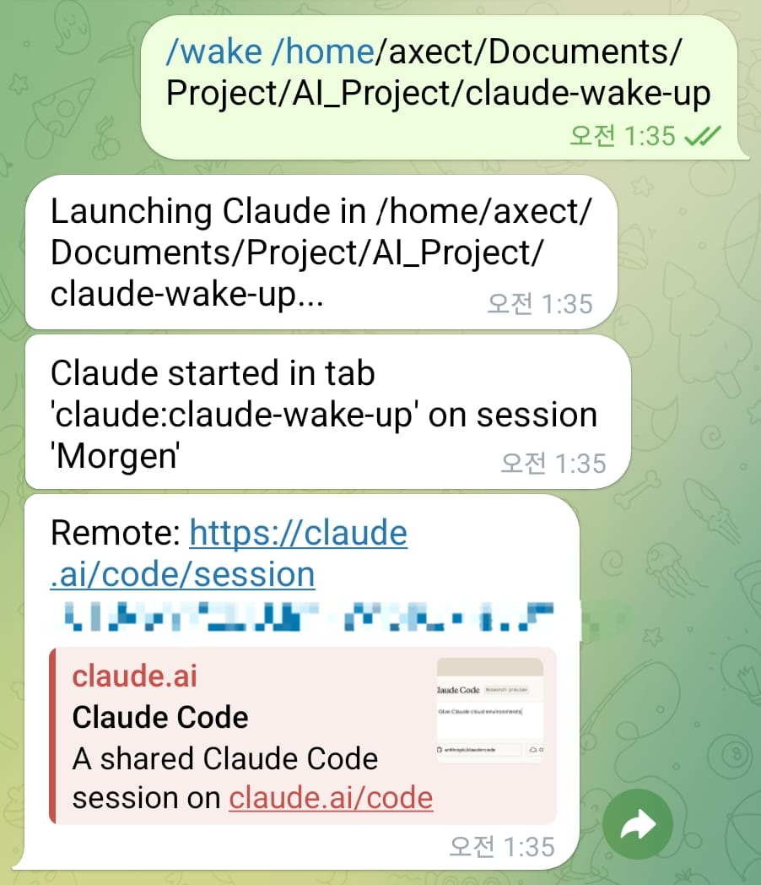
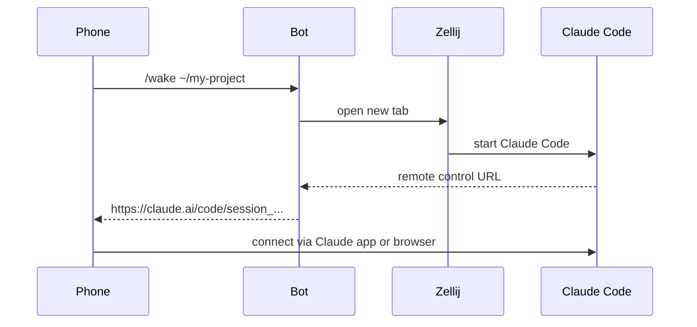

# claude-wake-up

> Launch Claude Code from your phone. Use the real thing remotely.

<p align="center">
  
</p>

A Telegram bot that starts [Claude Code](https://claude.ai/code) on your machine and sends back the [Remote Control](https://code.claude.com/docs/en/remote-control) link. Single-file Python. That's it.

**The philosophy:** Don't reinvent remote access. Just open the door — Claude Code's built-in Remote Control handles the rest. You get the full Claude experience (native app or web), with all your local MCP servers, plugins, and project context. No custom permission bridge. No proxy. No middleware.

## How It Works



1. Send `/wake ~/my-project` via Telegram
2. Bot opens a Zellij tab and starts Claude Code there
3. Claude Code generates a Remote Control URL
4. Bot captures it and sends it back to you
5. Open the link in the **Claude app** or **any browser** — full native experience

## Prerequisites

> **All of these must be ready before running claude-wake-up.**

| Requirement | Setup |
|---|---|
| **Linux or macOS** | Uses `script` for headless PTY (util-linux on Linux, BSD script on macOS) |
| **Claude Code** | [Install](https://code.claude.com/docs/en/getting-started) |
| **Remote Control = always on** | In Claude Code, run `/config` and set *"Enable Remote Control for all sessions"* to `true` |
| **Zellij** | `cargo install zellij` or [package manager](https://zellij.dev/documentation/installation) |
| **Python 3.12+** | [uv](https://github.com/astral-sh/uv) recommended |
| **Telegram bot token** | Message [@BotFather](https://t.me/BotFather) → `/newbot` |

Without Remote Control enabled, Claude Code won't generate session URLs — and the bot has nothing to send back.

## Quick Start

```bash
git clone https://github.com/Axect/claude-wake-up.git
cd claude-wake-up
claude
# then type: /setup
```

The `/setup` wizard checks dependencies, configures `.env`, and optionally registers the systemd service — all interactive.

Send `/wake /path/to/project` in Telegram. Get a remote control link back.

## Commands

| Command | What it does |
|---|---|
| `/wake <path>` | Launch Claude Code at `<path>` in a new Zellij tab |
| `/sessions` | List active Zellij sessions |
| `/status` | Bot health check |

The target Zellij session is auto-created if it doesn't exist.

## Why claude-wake-up?

[OpenClaw](https://github.com/openclaw/openclaw) and [NanoClaw](https://github.com/qwibitai/nanoclaw) are AI agent platforms — they run agents *inside* your messenger with their own permission systems. Powerful, but complex. OpenClaw has 500K+ lines and a [large attack surface](https://www.unite.ai/openclaw-vs-claude-code-remote-control-agents/). NanoClaw is leaner (~3,900 lines, container isolation), but still runs an agent layer between you and the AI.

claude-wake-up does something fundamentally simpler: **it only launches Claude Code.** One action, then it gets out of the way. You use Claude's own interface — the native app or claude.ai — with all your local MCP servers, plugins, and project context intact.

|  | OpenClaw | NanoClaw | claude-wake-up | SSH |
|---|---|---|---|---|
| **What it does** | AI agent in messenger | Containerized AI agent | Launches Claude Code, sends link | Manual session |
| **Complexity** | ~500K lines | ~3,900 lines | Single file | N/A |
| **Interface** | Chat in messenger | Chat in messenger | Claude app / claude.ai | Terminal |
| **Local MCP / plugins** | No | No | Yes (runs locally) | Yes |
| **Permission model** | Custom bridge | Container isolation | Claude Code's own | OS-level |
| **Attack surface** | Large | Container-scoped | Minimal (launcher only) | SSH keys |
| **Phone UX** | Chat | Chat | Native Claude UX | Terminal on phone |
| **Best for** | Chat-based AI commands | Autonomous agent tasks | Full coding sessions | Already at terminal |

### When NOT to use this

- You want an autonomous AI agent that acts on your behalf → OpenClaw / NanoClaw
- You just need a quick shell command → SSH
- You don't have a persistent machine → need a cloud setup
- You need multi-user access → this is a personal tool

---

<details>
<summary><strong>Manual Install</strong></summary>

If you prefer to set up manually instead of using `/setup`:

```bash
git clone https://github.com/Axect/claude-wake-up.git
cd claude-wake-up

cp .env.example .env
# Edit .env: bot token, Telegram user ID, Zellij session name
# Optional: set DANGEROUSLY_SKIP_PERMISSIONS=true for fully autonomous mode

uv run python bot.py
```

To run as a systemd service:

```bash
cp claude-wake-up.service ~/.config/systemd/user/

# Edit paths in the service file if needed, then:
systemctl --user daemon-reload
systemctl --user enable --now claude-wake-up.service

# Verify
systemctl --user status claude-wake-up.service
```

**Note:** The systemd service needs explicit `PATH` to find `zellij` and `claude`. The included service file sets this — adjust if your binaries are elsewhere.

</details>

<details>
<summary><strong>Troubleshooting</strong></summary>

| Error | Cause | Fix |
|---|---|---|
| `zellij not found in PATH` | Zellij not installed or not in service PATH | Install Zellij; update `Environment=PATH=...` in service file |
| `claude not found in PATH` | Claude Code CLI missing | [Install Claude Code](https://code.claude.com/docs/en/getting-started) |
| `script (util-linux) not found` / `BSD script not found` | Missing system utility | Linux: install `util-linux`; macOS: `script` is built-in (should exist at `/usr/bin/script`) |
| `Failed to create Zellij session` | Zellij can't start headless | Check if `zellij` runs manually; ensure `script` is available |
| `Path not found: /some/path` | Directory doesn't exist | Double-check the path in your `/wake` command |
| `Remote control URL not detected` | Remote Control not enabled | In Claude Code: `/config` → enable Remote Control for **all sessions** |

</details>

<details>
<summary><strong>Security Model</strong></summary>

claude-wake-up is a **launcher**, not a proxy. It starts Claude Code and gets out of the way.

**What the bot does:** Opens a Zellij tab, runs Claude Code, captures the Remote Control URL from terminal output, sends it to you. That is the entire scope.

**What the bot does NOT do:** Execute commands, read files, interact with Claude sessions, or maintain any connection after launch.

**`--dangerously-skip-permissions` (opt-in):** By default, Claude Code runs normally — it asks for confirmation before file writes and shell commands. If you set `DANGEROUSLY_SKIP_PERMISSIONS=true` in `.env`, Claude runs fully autonomously (no tool confirmations). This is useful for remote sessions where you can't click "allow" from your phone, but it means Claude can execute any action without asking. **Only enable this on machines you fully control.**

**Access control:** Telegram user ID whitelist (`TELEGRAM_ALLOWED_USERS`). Only listed users can trigger sessions.

**Design choice:** By delegating all remote interaction to Claude Code's own Remote Control (rather than building a custom command bridge), the attack surface is minimal: "can an unauthorized person launch a Claude session?" — not "can they execute arbitrary commands through a messenger?"

</details>

## License

MIT
